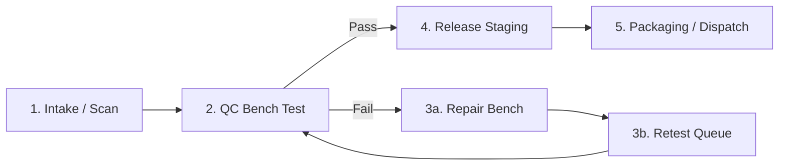

# Standard Operating Procedure (SOP): Device Journey & Failure Contingencies (Phase 3)

**Document ID:** SOP-ITAM-003  
**Target Roles:** Intake Technicians, Bench QC Operators, Refurbishing Leads, Floor Supervisors  
**Applicable Software:** SuperAutoMater Bench Client (v1.6.5+), SuperManager Cockpit (v1.0.0+)  

---

## 1. Standard Operational Flow (Receive -> Test -> Repair/Retest -> Release)

### Step 1: Receiving & Scan-First Intake
1. Place incoming pallet / box at Intake Station.
2. Ensure barcode scanner is connected (indicated by steady green LED on scanner cradle).
3. Scan manufacturer Serial Number or customer Asset Tag into SuperManager Intake screen.
   - *Confirmation:* Single high-pitch acoustic beep (`1600 Hz`) confirms identity capture.
4. Verify power adapter status by tapping numeric keypad (`1` OEM, `2` Third-party, `3` Missing, `4` USB-C).
5. Assign target staging location (e.g. `SHELF-A-04-01`).
6. Press `SPACEBAR` to print the thermal **Intake & Routing Label (3"x2")**. Adhere label to bottom chassis.
7. Transfer device to designated staging shelf in `ReadyForTest` state.

### Step 2: Diagnostic Bench Testing
1. Move batch from staging shelf to diagnostic bench. Connect AC power and gigabit Ethernet (or factory Wi-Fi).
2. Boot machine into SuperAutoMater environment.
3. System automatically identifies hardware identity and queries local SQLite store:
   - Asset transitions automatically from `ReadyForTest` -> `InTest`.
4. Allow automated tests to execute (CPU stress, RAM topology, NVMe SMART health, thermal dissipation).
5. Operator performs physical interactive tests (keyboard matrix sweep, display pixel sweep, audio beep-back, webcam optical inspection).
6. Upon conclusion:
   - If **ALL TESTS PASS**: Orchestrator generates SHA-256 cryptographic verification seal and assigns physical grade (e.g. `GRADE A`).
   - If **ANY TEST FAILS**: Orchestrator records exact failing sub-test (e.g. `DISPLAY_PIXEL_DEAD`, `BATTERY_WEAR_HIGH`) with metrics.

### Step 3: Repair & Retest Loop
1. For failing units:
   - Bench operator routes device to `Repair` queue with standard defect reason code.
   - Take macro photo of physical/cosmetic defect if applicable using station camera. The photo is hashed (SHA-256) and attached to the audit record.
   - Transfer physical unit to the Repair Bench.
2. Hardware technician completes parts replacement (e.g. LCD panel swap, battery replacement).
3. Technician marks repair completed: device transitions to `Retest` queue.
4. Unit returns to diagnostic bench and must complete a 100% full re-test pass.

### Step 4: Final Release & Audit Seal
1. Once QC run is verified `Completed` with cryptographic hash:
   - Operator clicks **Release Device** or scans release barcode.
   - System validates the strict Release Gate: checks for zero unresolved defects and valid SHA-256 seal.
2. Thermal printer produces **Hardware Verified Release Label (3"x2")** containing:
   - Certified Grade (`GRADE A`, `GRADE B+`, etc.).
   - Model, Serial, Date.
   - QR code linking directly to `/verify/{runId}`.
3. Apply label over chassis inspection port. Move unit to `ReadyForRelease` packaging bin.

---

## 2. Floor Failure Contingency Protocols

### 2.1 Scanner Hardware Malfunction
- **Symptom:** Handheld barcode scanner does not register scans or emits error tones.
- **Protocol:**
  1. Switch to keyboard entry: Press `ALT+T` for Asset Tag or `ALT+S` for Serial Number.
  2. Input characters manually. The system validates syntax against manufacturer serial masks (e.g. Dell 7-character alphanumeric Service Tag, Lenovo 8-character format).
  3. Swap USB scanner cable with hot-spare at technician supply locker.

### 2.2 Local Network / Wi-Fi Outage
- **Symptom:** Subnet discovery drops; SuperManager indicates "Offline Mode".
- **Protocol:**
  1. **DO NOT HALT WORK.** SuperAutoMater is an offline-first architecture.
  2. All intake records, QC test results, evidence hashes, and custody movements write directly to local SQLite database with write-ahead logging (`WAL` mode).
  3. Outbox events accumulate idempotently in `sync_outbox`.
  4. Once network connectivity is restored, `SyncOutboxDispatcher` automatically flushes pending records to SuperManager and cloud systems without data loss or duplicates.

### 2.3 Thermal Label Printer Failure / Media Jam
- **Symptom:** Printer red blinking light, out of paper, or label jam.
- **Protocol:**
  1. Clear paper path and reload 3"x2" direct thermal media roll.
  2. In SuperManager, enter the asset tag and click **Reprint Label** (or press `CTRL+P`).
  3. If printer hardware has failed, click **Export PDF Label**. The single-page true-size PDF is automatically routed to the secondary network backup printer.
